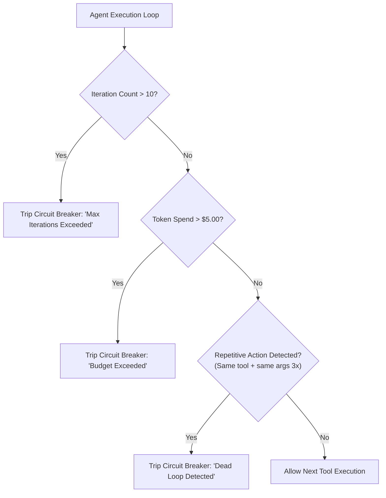

# Agent Guardrails & Termination Criteria

## 1. The Runaway Loop Vulnerability

Autonomous agents left unchecked will enter infinite loops when tools return unexpected errors, repeatedly trying the same failing parameters and consuming thousands of dollars in tokens within minutes.

---

## 2. Mandatory Production Guardrails
* **Max Steps Limit**: Hard ceiling of 8 to 12 iterations per task.
* **Cost Fence**: Maximum token budget per session (e.g., cap at 50,000 tokens).
* **Wall-Clock Timeout**: Automatic termination if total execution exceeds 120 seconds.
* **Repetitive Action Blocker**: An in-memory Bloom filter detects if an agent calls the identical tool with identical parameters more than twice consecutively.
