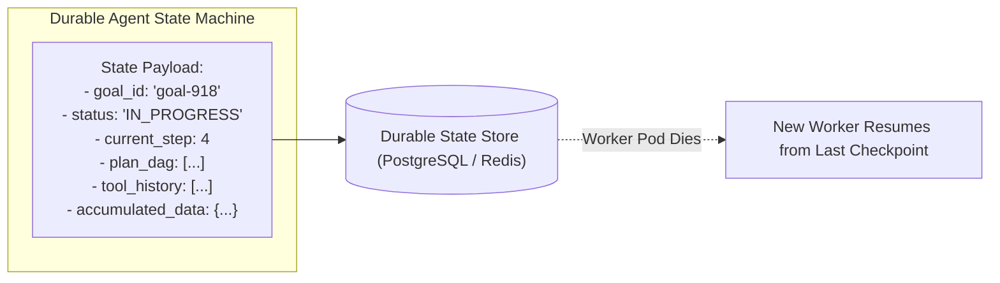

# Agent State & Goal Management Architecture

## 1. The Persistent Scratchpad

An agent cannot maintain state purely in volatile memory. If an agent executes a 10-step migration task that takes 5 minutes, a pod crash or network reset must not corrupt the operation.

The **Agent Scratchpad** must be persisted to a durable state store (Redis / PostgreSQL) after every single tool execution.

---

## 2. Invariants for Goal Completion
1. **Explicit Halting Conditions**: The agent prompt must specify exact, deterministic success criteria.
2. **Deterministic Validation**: An external verification function (not the agent itself) must assert that the target state has been achieved (e.g., verifying that a new database row actually exists).
