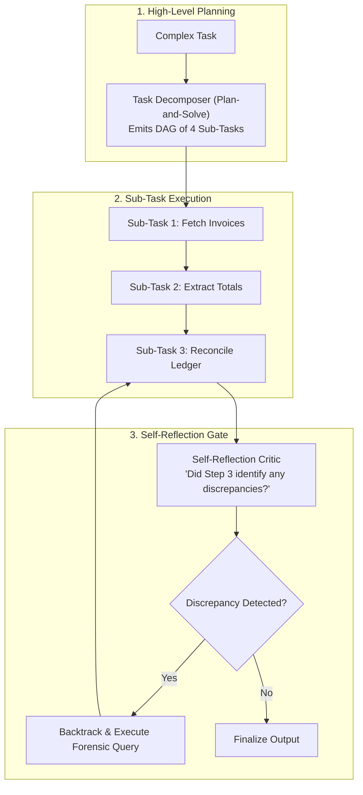

# Planning, Reasoning & Reflection in Agent Architecture

## 1. Cognitive Architectures for Agents

A simple ReAct agent operates myopically—deciding only one step at a time. Complex enterprise tasks require hierarchical planning and self-correction:

---

## 2. The Plan-and-Solve Pattern
* Separates **Planning** from **Execution**. A larger, high-reasoning model (e.g., Claude 3.5 Sonnet) generates an immutable, structured execution plan (JSON DAG). 
* Smaller, faster models (e.g., GPT-4o-mini) execute each atomic step sequentially, reducing token costs by 70% compared to allowing the large model to wander through continuous unconstrained loops.
