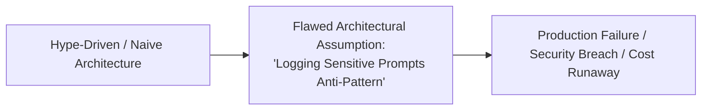
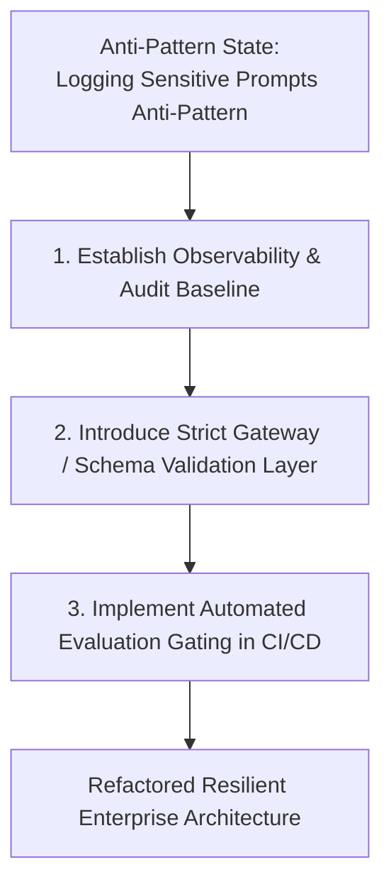

# Logging Sensitive Prompts Anti-Pattern

## 1. Executive Summary & Core Flaw
Logging unredacted user prompts containing passwords, SSNs, and credit cards directly into centralized observability APMs.

---

## 2. Architectural Symptoms & Warning Signs
* Unexpected latency spikes and severe user experience degradation.
* Escalating, unpredictable monthly cloud token bills without proportional business value.
* Security audit failures regarding cross-tenant data leakage, unvalidated inputs, or prompt injection vulnerability.
* Fragile software releases where minor prompt tweaks break downstream application parsing.

---

## 3. Root Cause Analysis

* **Vendor & Media Hype**: Adopting cutting-edge buzzwords (Agents, Fine-Tuning, Multi-Agent) without rigorous architectural feasibility evaluation.
* **Lack of Gating**: Bypassing Architecture Review Board (ARB) gates in the rush to launch AI proof-of-concepts (PoCs).

---

## 4. Catastrophic Business Impact
* **Financial Risk**: Uncapped token expenditures and cloud GPU waste destroying product margins.
* **Compliance & Legal Liability**: Leaking customer PII or violating EU AI Act / GDPR mandates.
* **Operational Outages**: Inability to diagnose non-deterministic bugs or debug complex multi-agent deadlocks.

---

## 5. Architectural Refactoring Path & Remedy

1. **Enforce Boundary Control**: Isolate the probabilistic AI components behind strict schema and policy guardrails.
2. **Apply Suitability Scoring**: Subject the workload to the [AI Suitability Framework](../decision-frameworks/ai-suitability-framework.md) to verify whether AI should be used at all.
3. **Automate Continuous Verification**: Measure accuracy and regressions using automated golden datasets and LLM-as-a-Judge before promoting code to production.
