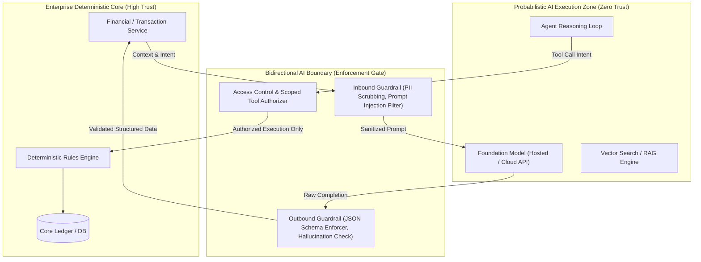

# AI System Boundaries & Trust Perimeters

## 1. Executive Summary & Architectural Intent

In classical software architecture, components interact via deterministic contracts: given identical inputs, an idempotent microservice produces identical outputs. When AI models—particularly Large Language Models—are introduced, architects must manage **inherent non-determinism, hallucinations, and probabilistic execution**.

Treating an AI model as an ordinary internal microservice is a critical architectural failure. **AI models must be positioned outside the core deterministic trust boundary**, guarded by bidirectional validation layers, schema enforcement, and explicit policy controls.

---

## 2. The Architectural Trust Perimeter

---

## 3. Boundary Invariants

1. **Zero Implicit Trust of Model Outputs**: The system must never execute a database write, dispatch a financial transaction, or trigger an external API call based directly on raw model strings. Every output must pass schema validation and business rule assertion.
2. **Context Minimization Across the Perimeter**: Only the minimum necessary enterprise data required to satisfy the prompt should cross the boundary into the probabilistic zone.
3. **Deterministic Failsafes**: If the probabilistic model fails, times out, or produces unparseable outputs, the boundary must fail securely to a deterministic fallback path.
