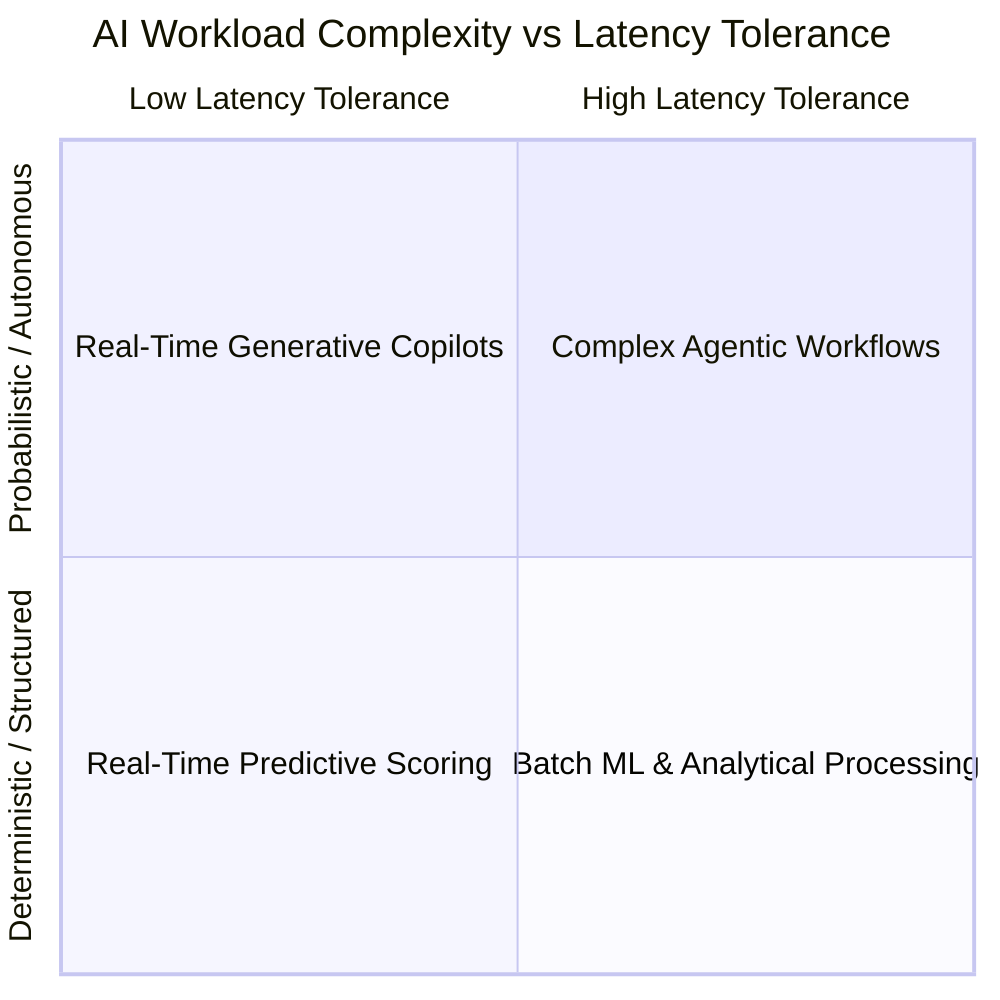

# AI Workloads Taxonomy & Execution Profiles

## 1. Executive Summary & Classification Matrix

Not all AI workloads share the same architectural characteristics. A computer vision batch pipeline operates under completely different compute, memory, and latency constraints than a real-time conversational customer support agent.

Enterprise architects must categorize AI workloads into four core archetypes to select appropriate infrastructure, serving patterns, and SLAs:

---

## 2. Workload Archetype Comparison

| Dimension | 1. Predictive ML | 2. Analytical AI / Search | 3. Generative Copilots | 4. Autonomous Agents |
| :--- | :--- | :--- | :--- | :--- |
| **Primary Task** | Classification, regression, fraud scoring, demand forecasting. | Semantic search, document deduplication, anomaly detection. | Text generation, code completion, conversational assistants. | Multi-step task execution, automated research, self-healing code. |
| **Output Type** | Floats, probabilities, discrete categorical labels. | Vector embeddings, similarity scores, ranked document lists. | Natural language text, structured JSON objects, code blocks. | Dynamic sequences of tool executions, state updates, API calls. |
| **Latency SLA** | 5ms – 50ms | 20ms – 200ms | 500ms – 3,000ms (TTFT < 800ms) | 5 seconds – 5 minutes (Async) |
| **Compute Profile** | High CPU or small GPU / TPU inference. | High memory, SIMD vector CPU instructions or specialized indexing GPUs. | Massive GPU VRAM (KV caching), high memory bandwidth. | Sustained GPU inference, high network I/O, heavy external API RPCs. |
| **Failure Mode** | Prediction error (false positive/negative); bounded impact. | Irrelevant search results; degraded user discovery. | Hallucination, unparseable JSON, toxic/unsafe language. | Infinite tool execution loops, unauthorized API mutations, high cost runaway. |
