# Predictive ML vs. Generative AI vs. Agentic Systems

## 1. Architectural Paradigms Compared

```mermaid
flowchart TD
    subgraph Predictive ["Predictive ML (Discriminative)"]
        In1["Structured Features (Vector X)"] --> Model1["Model: P(Y|X)"]
        Model1 --> Out1["Label / Score Y (Deterministic Schema)"]
    end
    subgraph Generative ["Generative AI (Foundation Models)"]
        In2["Prompt + Context"] --> Model2["Model: P(Next_Token | History)"]
        Model2 --> Out2["Generated Text / JSON / Multimodal"]
    end
    subgraph Agentic ["Agentic Systems (ReAct / Loops)"]
        In3["High-Level Goal"] --> Loop["Plan -> Tool -> Observe -> Reflect"]
        Loop --> Out3["Multi-Step Environmental Actions & Outcome"]
    end
```

---

## 2. Detailed Architectural Trade-Off Analysis

| Architectural Dimension | Predictive ML | Generative AI (RAG / Copilot) | Agentic Systems |
| :--- | :--- | :--- | :--- |
| **Core Abstraction** | Function: $f(x) \to y$ | Completion: $f(prompt, context) \to string$ | Controller: $f(goal, state, tools) \to actions$ |
| **Control Flow** | Fixed DAG (Directed Acyclic Graph). | Fixed sequence (Retrieve $\to$ Augment $\to$ Generate). | Dynamic, non-deterministic state loop. |
| **Determinism** | High (exact numerical outputs given fixed weights). | Medium (temperature controls sampling randomness). | Low (varying planning paths and tool selection). |
| **State Management** | Stateless per inference request. | Ephemeral conversational session memory. | Complex persistent state, scratchpad, long-term memory. |
| **Cost Predictability** | Highly predictable (fixed compute cost per inference). | Variable by token count ($Input + Output$). | Unpredictable (unbounded reasoning steps if unconstrained). |
| **Operational Risk** | Model drift, statistical degradation. | Hallucinations, prompt injection, data leakage. | Excessive agency, rogue tool executions, infinite loops. |
