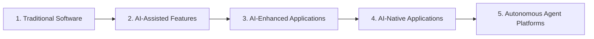

# The 5 Stages of Architectural Evolution to AI-Native Systems

## 1. Evolution Paradigm

Enterprises do not transform into "AI-native" organizations overnight. Architecture evolves through five distinct architectural phases, each demanding greater decoupling, stronger governance, and more resilient operational guardrails:

---

## 2. Deep Dive: The 5 Evolutionary Stages

### Stage 1: Traditional Deterministic Software
* **Architecture**: N-tier or Microservices architecture. Relational databases, deterministic business logic, strict schema serialization.
* **Role of AI**: Completely absent or isolated to external third-party analytics dashboards.

### Stage 2: AI-Assisted Features ("AI as a Plug-in")
* **Architecture**: Existing monolithic or microservice codebase adds an outbound HTTP call to an external model endpoint (e.g., OpenAI API).
* **Characteristics**: Ad-hoc API keys stored in configuration files; hardcoded prompts in application code; zero semantic caching; direct exposure to vendor downtime.

### Stage 3: AI-Enhanced Applications (RAG & Semantic Retrieval)
* **Architecture**: Introduction of dedicated vector storage, document embedding ingestion workers, and centralized prompt management.
* **Characteristics**: Hybrid search pipelines; context window management; basic evaluation suites; user feedback capture thumbs up/down.

### Stage 4: AI-Native Applications
* **Architecture**: System architecture is designed *around* probabilistic foundation models.
* **Characteristics**: Decoupled control and data planes; centralized AI Gateways; dynamic model routing across multiple model tiers; streaming token architectures; automated LLM-as-a-Judge evaluation gates in CI/CD.

### Stage 5: Autonomous Agent Platforms
* **Architecture**: Distributed multi-agent choreography where autonomous software agents discover and execute enterprise tools via standard protocols (e.g., MCP).
* **Characteristics**: Sandboxed tool runtimes; human-in-the-loop escalation circuits; continuous autonomous goal evaluation; cryptographically signed audit trails.
