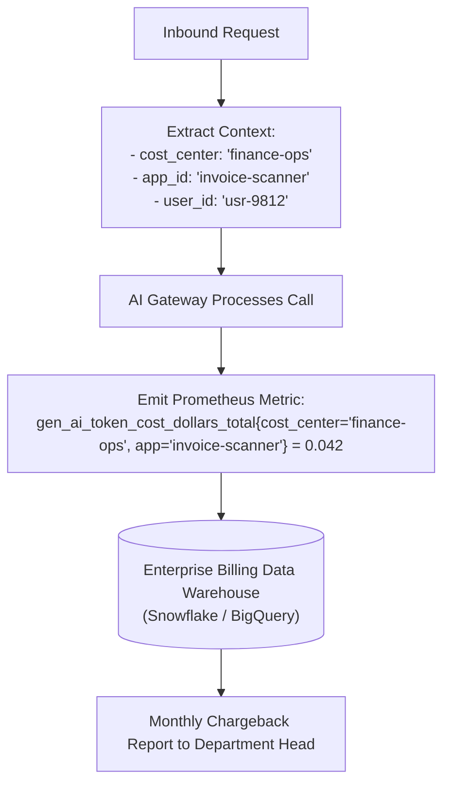

# Cost Allocation, Showback & Chargeback Architecture

## 1. Multi-Tenant Cost Attribution

A central AI platform cannot allow a single rogue business unit or experimental project to consume the corporate AI budget. Every token consumed must be tracked and attributed back to the initiating entity.

---

## 2. Showback vs. Chargeback Governance
* **Showback (Maturity Level 2–3)**: Visibility dashboards showing departments how much AI compute they are consuming, encouraging voluntary self-optimization.
* **Chargeback (Maturity Level 4–5)**: Direct internal financial ledger transfers: department cost centers are directly billed for their exact token consumption.
