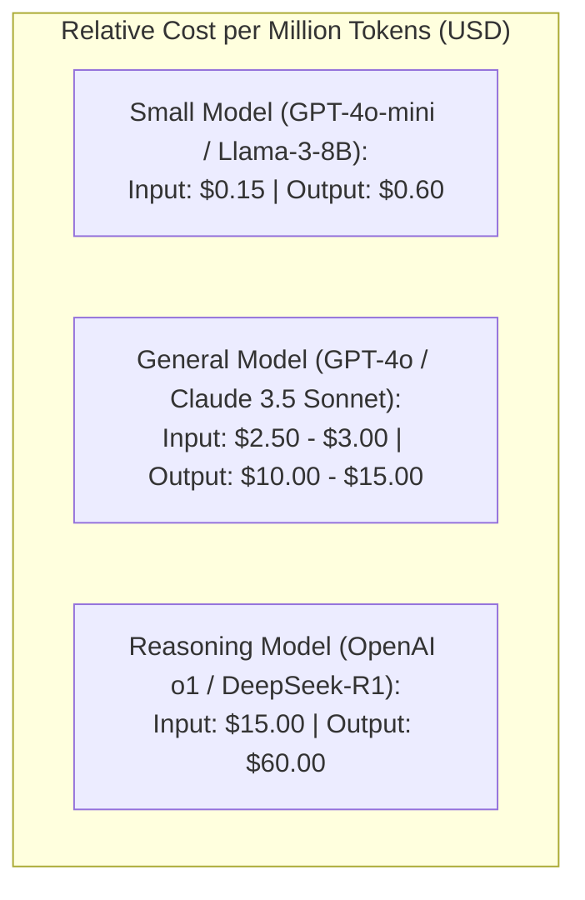

# Token Unit Economics & AI Cost Modeling

## 1. The Cost-per-Task Formulation

In traditional SaaS, server cost per active user is typically fractions of a cent per month. In AI applications, high-frequency users can cost **$10 to $100 per month in raw API fees**, completely erasing product profit margins.

Architects must model **Unit Economics** before building:
$$\text{Cost per Task} = (N_{\text{in}} \times P_{\text{in}}) + (N_{\text{out}} \times P_{\text{out}}) + \text{Cost}_{\text{embed}} + \text{Cost}_{\text{search}} + \text{Cost}_{\text{rerank}}$$

---

## 2. Invariant: Margin Protection Fences
The estimated cost of an AI task must never exceed **5% of the economic value** generated by that task. If a customer support ticket saves $5.00 in human agent labor, the total AI pipeline cost (prompt + retrieval + generation) must remain below $0.25 per resolution.
