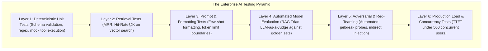

# Enterprise AI Testing Strategy

## 1. The AI Testing Pyramid

Classical testing assumes deterministic inputs and outputs. AI testing must embrace probabilistic validation across six distinct layers:

---

## 2. Automated Adversarial Red-Teaming
* Integrate automated fuzzing tools (e.g., PyRIT, Giskard) into monthly security testing schedules.
* Proactively inject thousands of mutated adversarial jailbreaks to measure the defensive posture of gateway guardrails before threat actors exploit them.
