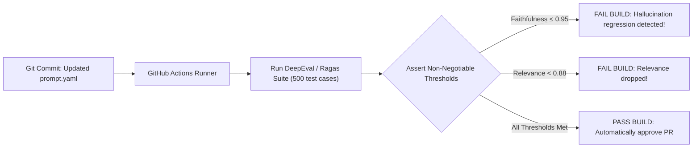

# Evaluation-Driven Development & CI/CD Deployment Gates

## 1. The Gated Pull Request Pipeline

Just as software engineers write unit tests before merging code, AI engineers practice **Evaluation-Driven Development (EDD)**:

---

## 2. Invariant: Cost and Time Ceilings in CI
Running 500 test cases against frontier models on every git commit costs money and takes time. 
* **Per-Commit Gate (PR Fast Check)**: Run 50 core smoke tests using fast SLMs (execution time $< 90\text{ seconds}$, cost $< \$0.25$).
* **Nightly / Pre-Release Gate**: Run the full 1,000+ golden benchmark suite across the production candidate model before deploying to production.
