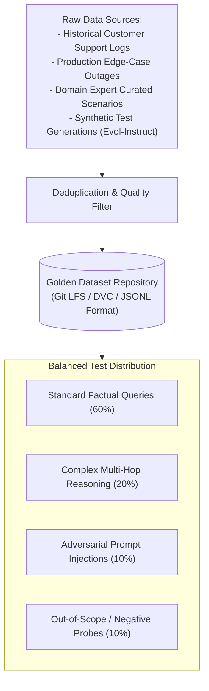

# Golden Datasets Curation & Maintenance Architecture

## 1. The Golden Dataset as an Enterprise Asset

A **Golden Dataset** is a version-controlled, high-quality collection of test queries, reference contexts, expected answers, and negative adversarial probes. It is the enterprise's primary defense against silent regressions.

---

## 2. Continuous Dataset Evolution
* Whenever a production incident or user thumbs-down report occurs, the failure scenario must be anonymized and committed to the Golden Dataset as a new regression test case.
