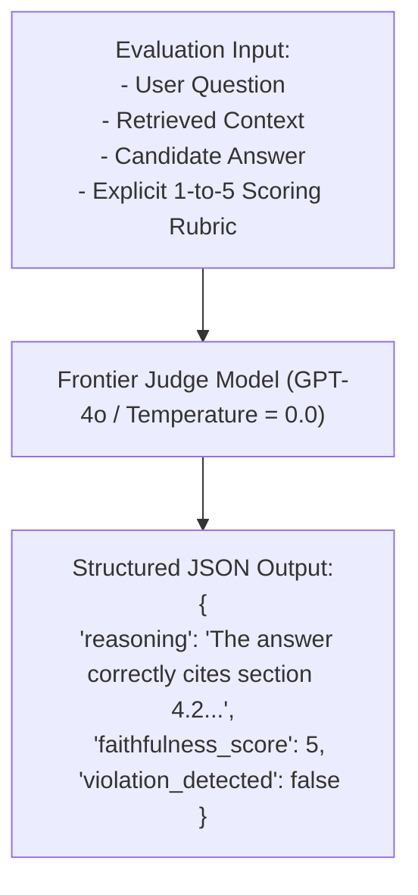

# LLM-as-a-Judge Architecture & Scoring Rubrics

## 1. The Frontier Model as Evaluator

Traditional NLP metrics (BLEU, ROUGE) rely on exact n-gram string overlap. They fail catastrophically at evaluating generative AI because two sentences can share zero words while conveying identical meaning.

**LLM-as-a-Judge** uses a frontier foundation model (e.g., GPT-4o, Claude 3.5 Sonnet) guided by explicit evaluation rubrics to score candidate responses on nuanced dimensions (faithfulness, clarity, safety, relevance).

---

## 2. Mitigating Judge Biases
* **Position Bias**: When comparing two models (A vs. B), judges inherently favor whichever model is presented first. **Mitigation**: Run evaluation twice, swapping the order ($A/B$ then $B/A$), and average the scores.
* **Verbosity Bias**: Judges favor long-winded answers over concise ones. **Mitigation**: Explicitly instruct the judge in the rubric: *"Penalize redundant verbosity; reward concise, accurate answers."*
* **Self-Enhancement Bias**: A model will score its own completions higher than competing models. **Mitigation**: Use an independent frontier judge from a different model family.
