# Offline vs. Online AI Evaluation Architecture

## 1. The Dual-Horizon Evaluation Strategy

```mermaid
flowchart TD
    subgraph PreDeploy ["1. Offline Pre-Deployment Evaluation (Gating)"]
        PR["Developer Pull Request"] --> EvalSuite["Run Automated Test Suite against Golden Dataset (500 Test Cases)"]
        EvalSuite --> Metrics["Compute Exact Scores:\n- RAG Faithfulness\n- Answer Relevance\n- Schema Conformance"]
        Metrics --> GateDecision{"Score >= Baseline?"}
        GateDecision -->|Yes| Deploy["Promote to Production"]
        GateDecision -->|No| Block["Block Deployment"]
    end

    subgraph PostDeploy ["2. Online Post-Deployment Evaluation (Monitoring)"]
        LiveTraffic["Live Production Prompts & Completions"] --> Sampler["Asynchronous 5% Traffic Sampler"]
        Sampler --> Redactor["PII Redaction Engine"]
        Redactor --> OnlineJudge["Continuous LLM-as-a-Judge Worker"]
        OnlineJudge --> Timeseries[("Time-Series Quality Dashboard (Prometheus)")]
        Timeseries --> Alert{"Drift Alert (> 5% drop)?"}
        Alert -->|Yes| PageOps["Trigger SRE Alert"]
    end
```

---

## 2. Trade-Off Analysis

| Dimension | Offline Evaluation (Pre-Deployment) | Online Evaluation (Post-Deployment) |
| :--- | :--- | :--- |
| **Execution Timing** | In CI/CD pipeline before code merge. | Continuously in production on live traffic. |
| **Data Source** | Fixed, curated Golden Dataset with known ground truth. | Uncurated, real-world user queries (no ground truth). |
| **Primary Goal** | Prevent regressions during prompt/model updates. | Detect model drift, unexpected user behaviors, and edge failures. |
| **Latency Impact** | Zero user impact (runs in CI runner). | Zero user impact (runs asynchronously out-of-band). |
| **Cost Profile** | Small, predictable batch LLM cost per pull request. | Constant background token cost proportional to sampled traffic. |
