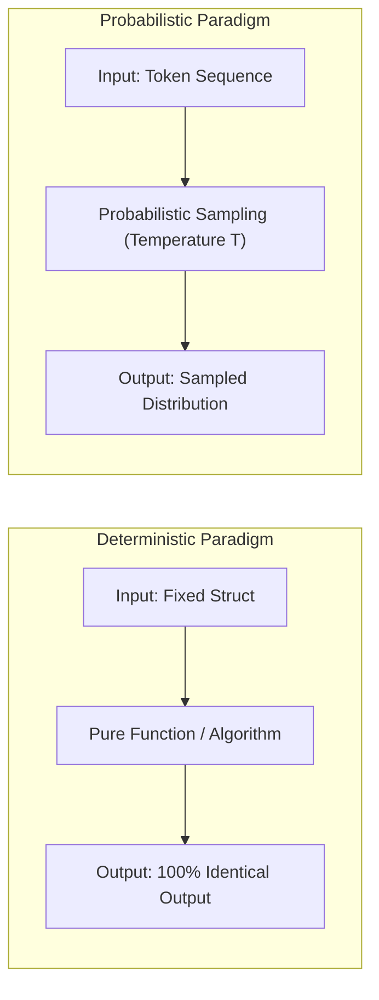

# Probabilistic vs. Deterministic Systems Architecture

## 1. Executive Summary & Paradigm Clash

Software engineering has spent five decades developing tools, patterns, and principles optimized for **deterministic computing**:
* Idempotency guarantees
* ACID transactions
* Exact unit test assertions (`assert actual == expected`)
* Static type safety
* Deterministic state machines

Artificial Intelligence models are **stochastic prediction engines**:
$$\hat{y} = \arg\max_{y \in \mathcal{V}} P(y \mid x_1, x_2, \dots, x_t; \theta)$$

When deterministic systems integrate with probabilistic systems, standard architectural assumptions fail catastrophically unless explicit translation layers are established.

---

## 2. Structural Comparison

| Dimension | Deterministic Software | Probabilistic AI System |
| :--- | :--- | :--- |
| **Execution Model** | Step-by-step logic, branching if-else statements. | High-dimensional tensor multiplication sampling probability distributions. |
| **Testing Strategy** | Unit, integration, end-to-end exact equality assertions. | Statistical evaluation against golden datasets (LLM-as-a-judge, BLEU, ROUGE). |
| **Error Handling** | Throw/catch exceptions; retry on transient I/O failures. | Hallucination mitigation, self-correction, schema validation retries. |
| **Idempotency** | Achieved via transaction keys and deterministic hashing. | Not guaranteed unless temperature = 0 and seed is pinned (even then, provider changes alter weights). |
| **Debugging** | Stack traces, step-through debuggers, exact line numbers. | Attention visualization, logit inspection, prompt permutation testing. |

---

## 3. Architectural Design Invariants

1. **Temperature Governance**: For tasks requiring strict data extraction, schema compliance, or routing decisions, set temperature to `0.0`. Reserve temperature $> 0.7$ strictly for creative synthesis.
2. **Schema Encasement**: All probabilistic outputs meant for downstream machine consumption must be forced into strict JSON Schemas using constrained decoding or grammar-based sampling.
3. **Graceful Fallbacks**: When a probabilistic model outputs an invalid response after $N$ attempts, execution must immediately fall back to a deterministic rules engine or route to a human reviewer.
