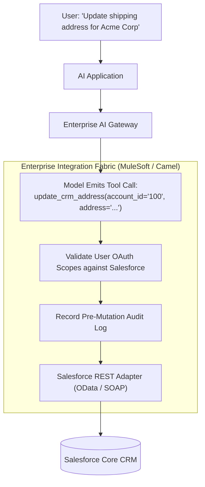

# Enterprise ERP & CRM AI Integration Architecture

## 1. Bridging AI to Systems of Record (SAP & Salesforce)

Connecting AI assistants to core systems of record (SAP ERP, Salesforce CRM, Workday) must preserve enterprise security, record-level permissions, and transactional consistency:

