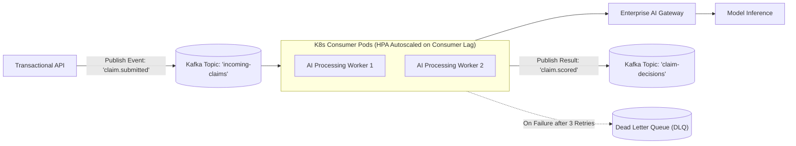

# Event-Driven AI Pipelines & Streaming Inference

## 1. Asynchronous Event-Driven Architecture

In high-throughput enterprise systems, invoking synchronous LLM calls during user transaction paths destroys throughput. Event-driven architectures decouple the ingestion of requests from AI inference.

