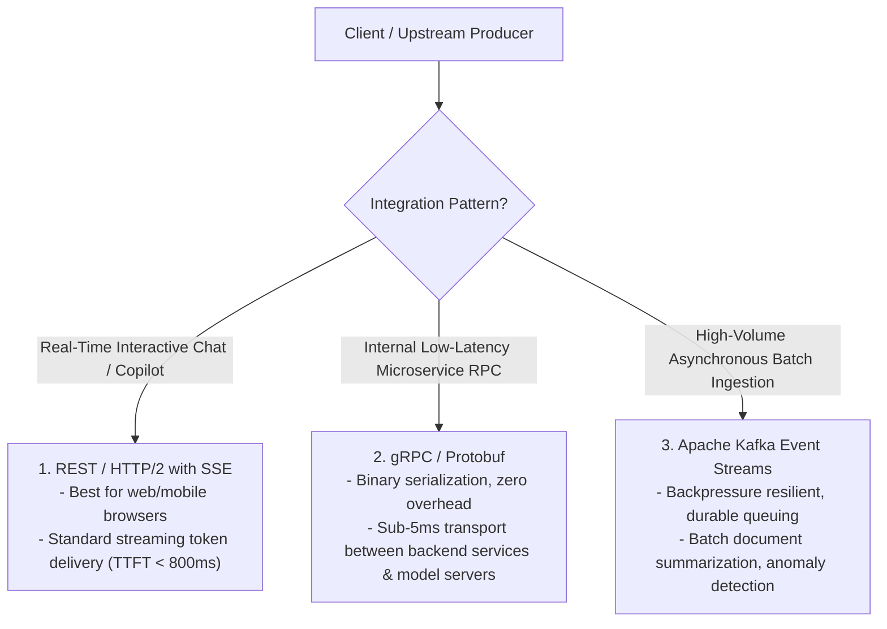

# Integrating AI with REST, gRPC & Apache Kafka

## 1. Multi-Protocol Integration Matrix

Enterprise architectures demand different protocols depending on the AI workload's interaction model:

---

## 2. Invariant: Circuit Breaking on Model Endpoints
When exposing synchronous REST/gRPC endpoints wrapping foundation models, always configure Resilience4j / Envoy circuit breakers with a maximum timeout of 10 seconds. Unbounded HTTP thread pool consumption during upstream LLM latency spikes will crash the calling microservice.
