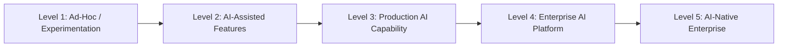

# Enterprise AI Architecture Maturity Model

## 1. Executive Summary & Maturity Taxonomy

Enterprise AI maturity is not determined by how many proofs-of-concept (PoCs) an organization runs or whether it licenses proprietary foundation models. True maturity is measured by **repeatability, architectural control, deterministic evaluation, cost governance, security isolation, and business value realization**.

This maturity model defines 5 distinct stages through which global enterprises progress:

---

## 2. Multi-Dimensional Maturity Matrix

| Dimension | Level 1: Ad-Hoc / PoC | Level 2: AI-Assisted Features | Level 3: Production AI Capability | Level 4: Enterprise AI Platform | Level 5: AI-Native Enterprise |
| :--- | :--- | :--- | :--- | :--- | :--- |
| **Architectural Scope** | Scattered developer API keys; hardcoded prompts in client code. | Point-to-point wrappers; microservice calling external LLM API directly. | Decoupled AI gateways; standardized RAG pipelines with dedicated vector storage. | Centralized AI platform; shared model routing, unified control plane, self-service catalogs. | Ubiquitous autonomous workflows, multi-agent choreography, dynamic model distillation. |
| **Suitability & Governance** | "AI for everything"; hype-driven adoption with zero business case review. | Product-led feature ideation; informal approval without threat modeling. | Formal AI Suitability Framework; risk-tier classification (EU AI Act aligned). | Centralized AI Review Board (ARB); model inventory, lifecycle retirement policies. | Autonomous compliance gating; continuous policy-as-code enforcement and audit logging. |
| **Data & Knowledge** | Public prompts with raw enterprise data leaks; uncurated PDFs. | Ad-hoc document dumping into naive vector indexes; no metadata. | Chunking optimization; tenant-isolated vector indexes, document ACL synchronization. | Enterprise knowledge graphs; hybrid search (BM25 + Dense + Reranking), CDC data freshness. | Multi-modal federated knowledge fabric; automated synthetic data generation and curation. |
| **Evaluation & Quality** | "Vibe checks"; manual inspection of 5 sample outputs. | Static test cases in unit test suites; brittle exact-string matching. | Automated regression test suites; golden datasets, LLM-as-a-Judge benchmarking. | Continuous online evaluation; RAG triad scoring in production, drift alerting. | Automated self-improving prompt optimization (DSPy), active reinforcement learning loops. |
| **Security & Privacy** | Zero sanitization; exposed credentials, high prompt injection vulnerability. | Basic regex scrubbing for SSNs/credit cards; static API tokens. | Input/output guardrails (NeMo, Llama Guard); Workload Identity, tenant data isolation. | Enterprise AI Gateway enforcing OWASP LLM Top 10 controls; indirect injection defense. | Cryptographically verified model provenance (SLSA L3), confidential GPU computing enclaves. |
| **Observability & SRE** | Unmonitored black-box calls; no token tracking or error monitoring. | Basic HTTP status codes and endpoint response time tracking. | OpenTelemetry GenAI tracing; token metrics, time-to-first-token (TTFT), cost per call. | Multi-window burn rate alerts on token budgets; automated model fallback cascades. | Predictive latency throttling; dynamic multi-provider traffic shedding and self-healing. |
| **Cost & FinOps** | Uncapped corporate credit cards; surprise monthly API invoices. | Hard monthly budget caps per department; manual billing reviews. | Cost-per-request and cost-per-user tracking; basic semantic caching. | FinOps unit economics; model routing (small/large model cascades), batch inference tiers. | Dynamic cost arbitrage across spot GPU clusters and serverless model endpoints. |

---

## 3. Level Transitions & Pitfalls

```mermaid
flowchart TD
    subgraph Level1to2 ["Transition: Level 1 -> Level 2"]
        T1["Eliminate Scattered Keys"] --> T2["Standardize on Central API Credentials"]
        T2 --> T3["Establish Basic PII Redaction"]
    end
    subgraph Level2to3 ["Transition: Level 2 -> Level 3"]
        T4["Implement Automated Evaluation"] --> T5["Deploy Dedicated Vector DB with ACLs"]
        T5 --> T6["Establish AI Architecture Review Gates"]
    end
    subgraph Level3to4 ["Transition: Level 3 -> Level 4"]
        T7["Deploy Enterprise AI Gateway"] --> T8["Centralize Model Routing & Fallback"]
        T8 --> T9["Implement FinOps Token Unit Economics"]
    end
    subgraph Level4to5 ["Transition: Level 4 -> Level 5"]
        T10["Autonomous Agent Orchestration"] --> T11["Continuous Model Distillation & Fine-Tuning"]
        T11 --> T12["Confidential Compute & Zero-Trust AI Fabric"]
    end
```

### Lethal Pitfalls During Progression
1. **Premature Platform Engineering (Level 2 $\to$ 4)**: Attempting to build an elaborate internal Kubernetes GPU serving platform before product-market fit or stable workload patterns exist.
2. **Evaluation Neglect (Level 1 $\to$ 3)**: Promoting RAG pipelines or agents to production without golden test sets, leading to silent catastrophic hallucinations in customer-facing workflows.
3. **The "Everything is an Agent" Fallacy (Level 3 $\to$ 5)**: Replacing reliable, deterministic workflow engines (Temporal, Step Functions) with non-deterministic autonomous multi-agent loops that fail intermittently and burn tokens uncontrollably.
