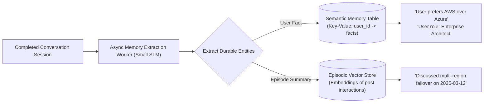

# Episodic & Semantic User Memory Architecture

## 1. Extracting Durable Facts from Conversations

To provide continuous personalization across sessions without passing full historical transcripts, the system uses an **Asynchronous Memory Extractor Worker**:

---

## 2. Invariant: User Transparency & Editing
Enterprise systems must provide an administrative UI allowing users to view, edit, and delete their stored semantic memories. Storing secret, invisible behavioral dossiers violates consumer trust and privacy regulations.
