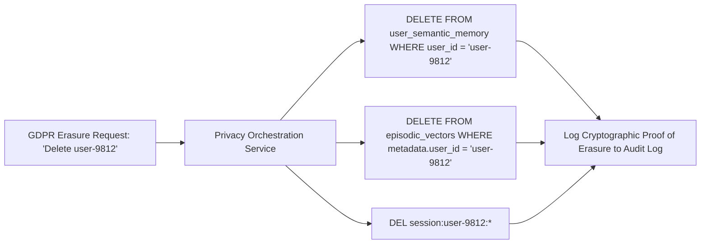

# Memory Privacy & GDPR Right-to-be-Forgotten Compliance

## 1. The Challenge of Machine Learning Erasure

Deleting a user's data from a fine-tuned model checkpoint is computationally impossible without re-training the entire model from scratch at millions of dollars in compute cost.

By keeping the foundation model **completely stateless** and isolating all personal user data within an **External Memory Architecture**, enterprise systems can comply with GDPR Article 17 (Right to Erasure) in milliseconds.

---

## 2. Cryptographic Shredding
For multi-tenant SaaS environments, encrypt each tenant's memory partition with a unique per-tenant Key Encryption Key (KEK) in AWS KMS / HashiCorp Vault. To execute instantaneous complete erasure, simply delete the tenant's KEK, rendering all vector and text memory mathematically unrecoverable.
