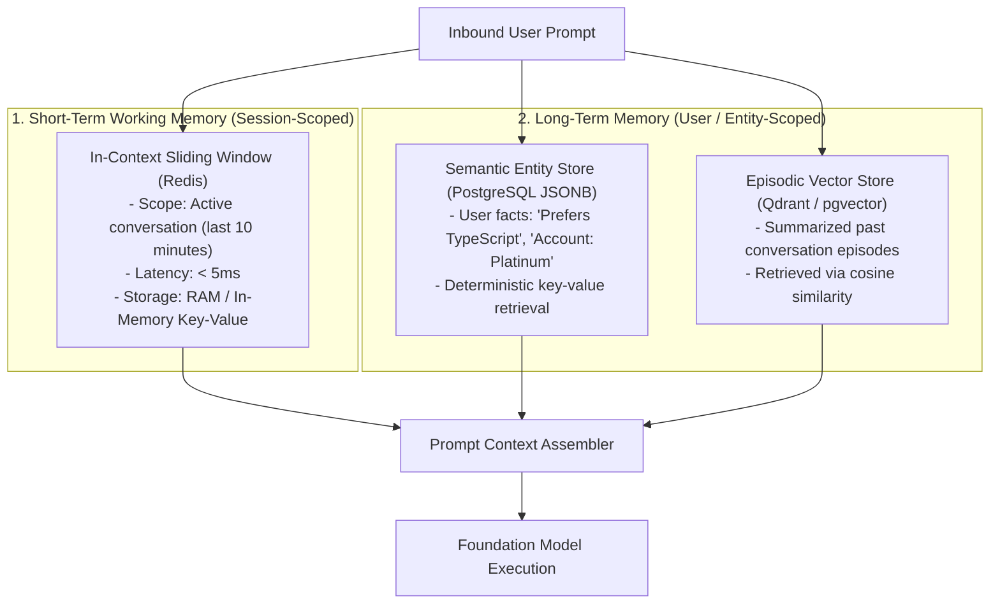

# Short-Term vs. Long-Term AI Memory Architecture

## 1. Memory Tiering Taxonomy

---

## 2. Memory Eviction Policies
* **Short-Term Memory**: Automatic TTL eviction after 24 hours of user inactivity.
* **Long-Term Memory**: Hierarchical decay algorithm. High-frequency facts maintain high retention weights; ephemeral one-off statements are decayed and purged after 90 days.
