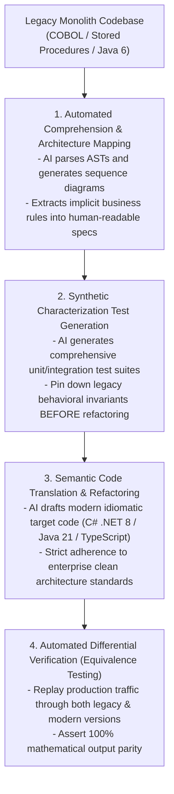

# AI-Assisted Legacy Modernization Methodology

## 1. The 4-Stage Modernization Lifecycle

---

## 2. Invariant: Characterization Tests First
Never allow an LLM to rewrite a legacy function until a comprehensive suite of **Characterization Tests** has been established and executed against the legacy implementation.
