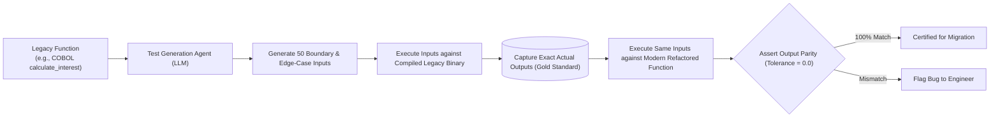

# Automated Code Refactoring & Synthetic Test Generation

## 1. The Characterization Test Strategy

When modernizing legacy systems, documentation is frequently absent or outdated. The legacy source code itself is the only authoritative specification.

