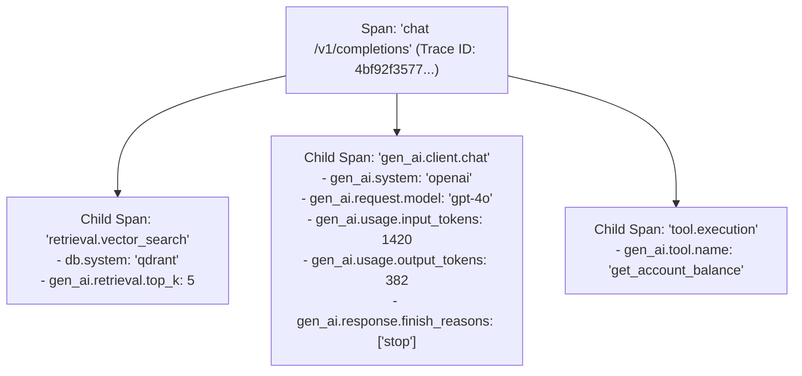

# OpenTelemetry GenAI Semantic Conventions Architecture

## 1. Standardizing Distributed AI Traces

To avoid vendor lock-in across proprietary AI monitoring tools, systems must instrument tracing using standard **OpenTelemetry (OTel) Semantic Conventions for Generative AI**:

---

## 2. Standardized OTel Attributes
* `gen_ai.system`: Identifier of the provider (`openai`, `anthropic`, `vertex_ai`, `vllm`).
* `gen_ai.request.model`: The specific model version requested.
* `gen_ai.usage.input_tokens`: Exact integer count of prompt tokens.
* `gen_ai.usage.output_tokens`: Exact integer count of completion tokens.
* `gen_ai.server.time_to_first_token`: Microseconds elapsed before first token emission.
