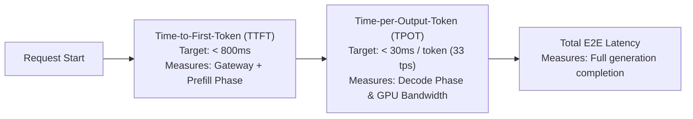

# Token Telemetry & Latency SRE Metrics

## 1. The Core SRE Metrics for GenAI

Traditional HTTP metrics (P99 request latency) are misleading for streaming LLMs because a 10-second response that streams immediately feels fast, whereas a 2-second response that blocks feels slow.

---

## 2. Multi-Window Alerting on Token Burn
* Apply SRE multi-window burn-rate alerting (from Phase 7) to **Token Budgets**:
  * If an application consumes $> 5\%$ of its monthly allocated token quota within a 1-hour window, trigger a High-Severity PagerDuty incident to halt runaway loops.
