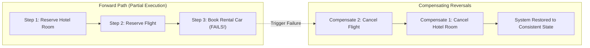

# Compensation Patterns for AI Workflows

## 1. The Asymmetric Failure of AI Operations

In traditional database systems, a transaction is wrapped in `BEGIN TRANSACTION ... COMMIT`. If an error occurs, the database executes an automatic `ROLLBACK`.

When an AI workflow interacts with distributed SaaS systems, cloud APIs, and microservices across a 10-minute session, **there is no distributed ACID rollback**. If Step 4 fails due to model hallucination or rate limits, the system must execute explicit **Compensating Actions** in reverse order:

---

## 2. Invariants for Compensation Handlers
1. **Idempotency**: All compensating functions must be safe to execute multiple times without side effects.
2. **Audit Logging**: Every compensation event must be logged to an append-only compliance ledger recording why the AI failed and which financial or operational resources were released.
