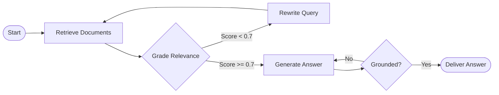

# State Graphs & Cyclic Execution Architecture

## 1. Why DAGs Are Insufficient for Agentic AI

Standard workflow engines (Airflow, Kubeflow, standard AWS Step Functions) are **Directed Acyclic Graphs (DAGs)**: execution flows strictly in one direction from input to output with zero loops allowed.

AI agentic reasoning is fundamentally **cyclic**: an agent must generate an answer, evaluate it, loop back upon failure, refine its search, and reflect until a quality criterion is satisfied.

---

## 2. Checkpointing and State Machines
In a State Graph engine, state is modeled as an immutable TypedDict or Pydantic class passed between functional nodes. Between each execution "superstep", the engine saves a snapshot of the state to a persistent database (Postgres/Redis), enabling instant pause-and-resume for human reviews.
