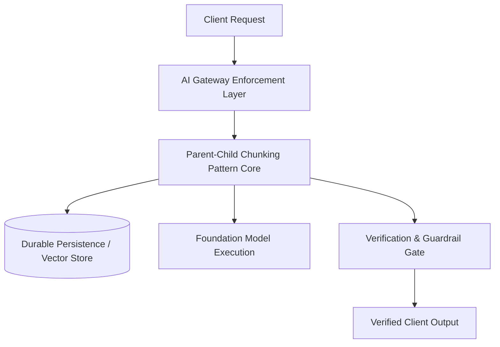

# Parent-Child Chunking Pattern

## 1. Intent & Context
Decouples the retrieval unit from the generation unit: embeds small 128-token child chunks for precision, returning 1024-token parent sections for LLM context. In enterprise distributed architectures, this pattern provides a proven, standardized blueprint for production reliability, cost control, and security isolation.

---

## 2. Problem Statement
Point-to-point integrations and ad-hoc implementations suffer from severe latency spikes, runaway token expenses, unmitigated hallucination risks, and tight vendor coupling. Systems require a decoupled, resilient architecture to govern execution safely.

---

## 3. Architecture & Topology

---

## 4. Key Components & Contracts
* **Gateway Interceptor**: Validates incoming auth tokens, checks rate limits, and enriches request context.
* **Core Orchestrator**: Executes the primary logic of the pattern, coordinating state transitions and external dependencies.
* **Verification Gate**: Enforces JSON Schema validation, safety checks, and threshold verifications before output emission.

---

## 5. Data Flow & Sequence
1. Inbound request arrives at the API boundary with verified identity metadata.
2. The orchestrator inspects cache and policy constraints.
3. Execution proceeds through the pattern workflow, logging structured telemetry spans.
4. Downstream outputs are verified against accuracy and safety constraints.
5. Final response is streamed or returned to the client.

---

## 6. Security & Governance Invariants
* **Tenant Scoping**: All operations are cryptographically bound to the authenticated `tenant_id`.
* **Zero Plaintext Secrets**: Credentials and API tokens are managed via KMS envelope encryption.
* **Audit Trails**: All model interactions, prompts, and tool actions are logged to WORM compliance storage.

---

## 7. Reliability & Failure Modes
* **Circuit Breakers**: Upstream 429/503 errors trigger automatic fallback within 150ms.
* **Idempotency**: All operations utilize deterministic idempotency keys to prevent duplicate execution on retries.

---

## 8. Cost & Performance Economics
* **Unit Cost Optimization**: Minimizes unnecessary model calls through caching, filtering, and model sizing.
* **Latency SLA**: Sub-second execution for synchronous paths; asynchronous execution for complex reasoning.

---

## 9. Trade-Off Analysis
| Advantages | Disadvantages |
| :--- | :--- |
| High architectural repeatability and proven reliability. | Requires additional gateway and caching infrastructure. |
| Eliminates vendor lock-in and controls token expenditures. | Slight initial development and operational overhead. |

---

## 10. When to Use
* High-volume enterprise workloads requiring strict SLAs and cost ceilings.
* Multi-tenant systems demanding total data isolation.
* Mission-critical operations requiring deterministic validation.

---

## 11. When NOT to Use
* Simple exploratory prototypes or hackathon demonstrations.
* Completely static deterministic workflows that require zero natural language understanding.
