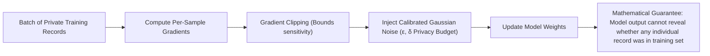

# Differential Privacy & Training Data Protection

## 1. The Model Memorization Hazard

Neural networks have been proven capable of **verbatim memorization** of rare training records (e.g., extracting social security numbers or private credit card numbers simply by prompting the model with prefix strings).

When fine-tuning models on proprietary enterprise datasets, architects must enforce **Differentially Private Stochastic Gradient Descent (DP-SGD)**.

