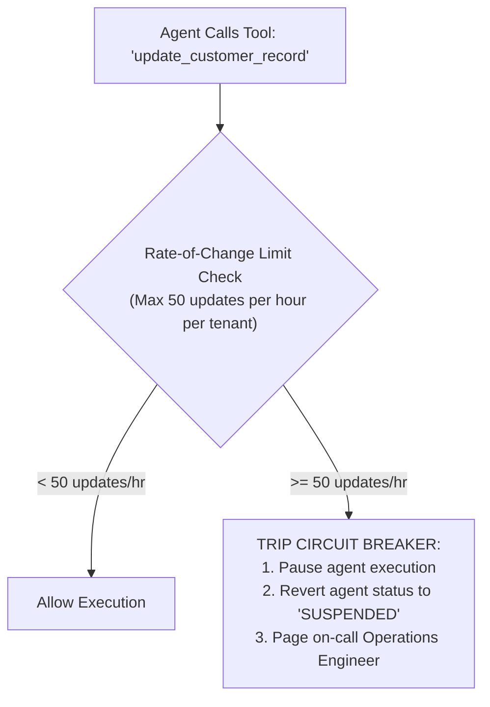

# Autonomous Action Limits & Circuit Breakers

## 1. The Danger of Unbounded Agency

When AI agents are given tools to mutate enterprise systems (e.g., creating Jira tickets, updating CRM leads, modifying database rows), an undetected logic flaw or model hallucination can trigger **cascading data corruption across thousands of records in seconds**.

---

## 2. Rate-of-Change Circuit Breakers

The AI Gateway must enforce **Rate-of-Change (RoC) Fences** on all state-mutating tool invocations:

### Invariant: Emergency Dead-Man Switch
Every autonomous agent platform must expose an instantaneous global kill switch in the control plane (`POST /v1/admin/agents/kill-all`), immediately terminating all active agent execution containers and severing tool database credentials within 500ms.
