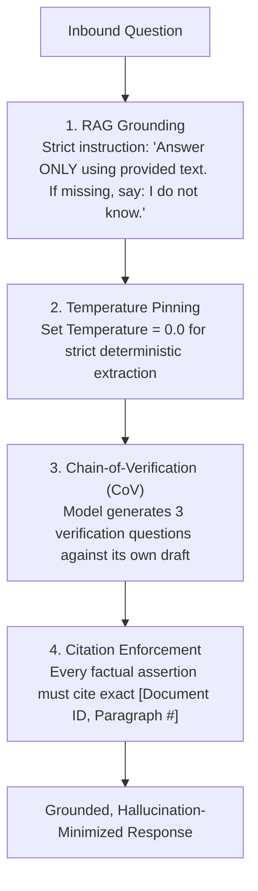

# Hallucination Mitigation Architecture

## 1. The Causes of Hallucination

Large Language Models are probabilistic token generators; they optimize for fluency and plausibility, not factual truth. Models hallucinate when:
* Prompt instructions conflict with pretraining data.
* Retrieved RAG context is noisy or incomplete.
* The model is forced to answer questions outside its knowledge boundary without an explicit permission to say *"I do not know"*.

---

## 2. The 4-Pillar Mitigation Architecture

