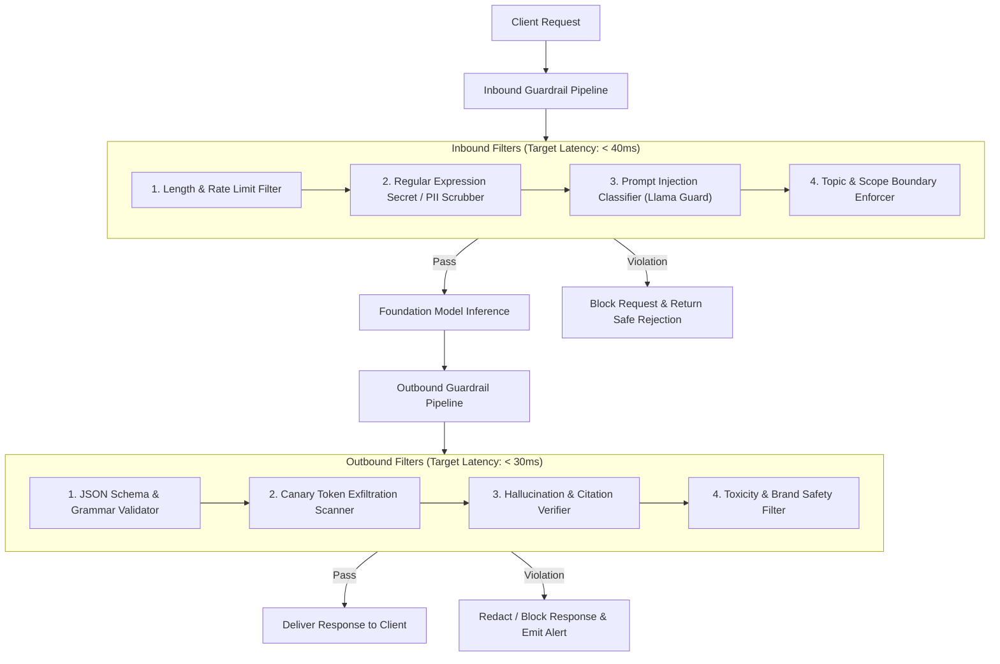

# Input & Output Guardrails Architecture

## 1. The Dual-Perimeter Guardrail Topology

```mermaid
flowchart TD
    ClientReq["Client Request"] --> InFilter["Inbound Guardrail Pipeline"]
    
    subgraph InboundChecks ["Inbound Filters (Target Latency: < 40ms)"]
        F1["1. Length & Rate Limit Filter"]
        F2["2. Regular Expression Secret / PII Scrubber"]
        F3["3. Prompt Injection Classifier (Llama Guard)"]
        F4["4. Topic & Scope Boundary Enforcer"]
        F1 --> F2 --> F3 --> F4
    end

    InFilter --> InboundChecks
    InboundChecks -->|Pass| Model["Foundation Model Inference"]
    InboundChecks -->|Violation| BlockIn["Block Request & Return Safe Rejection"]

    Model --> OutFilter["Outbound Guardrail Pipeline"]

    subgraph OutboundChecks ["Outbound Filters (Target Latency: < 30ms)"]
        G1["1. JSON Schema & Grammar Validator"]
        G2["2. Canary Token Exfiltration Scanner"]
        G3["3. Hallucination & Citation Verifier"]
        G4["4. Toxicity & Brand Safety Filter"]
        G1 --> G2 --> G3 --> G4
    end

    OutFilter --> OutboundChecks
    OutboundChecks -->|Pass| Deliver["Deliver Response to Client"]
    OutboundChecks -->|Violation| BlockOut["Redact / Block Response & Emit Alert"]
```
