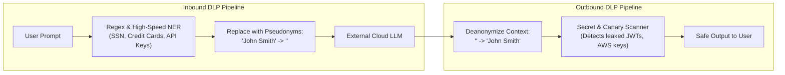

# Sensitive Data Disclosure & Exfiltration Architecture

## 1. Inbound & Outbound Data Loss Prevention (DLP)

Enterprise AI systems must enforce bidirectional data protection: preventing users from sending sensitive corporate PII/secrets to third-party model providers, and preventing models from outputting confidential data to unauthorized clients.

---

## 2. Zero Data Retention (ZDR) Enterprise Agreements
For enterprise deployments consuming multi-tenant foundation model APIs (Azure OpenAI, AWS Bedrock, Anthropic, OpenAI Enterprise), architects must verify that legal agreements include **Zero Data Retention (ZDR)**:
* Customer prompts and completions are processed entirely in-memory and discarded immediately upon generation.
* Customer data is **never logged to vendor disks** and **never used to train future public foundation models**.
