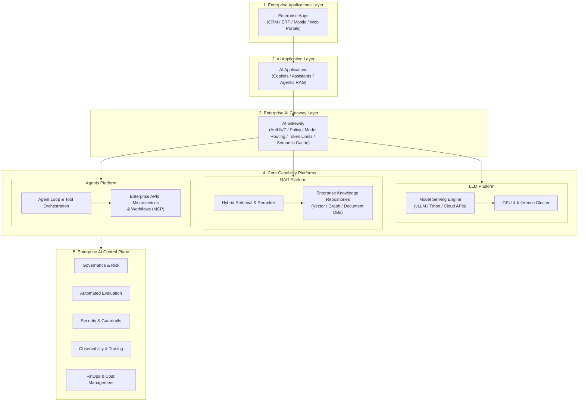

# AI Systems & Platform Architecture (`ai-systems-architecture/`)

## Executive Summary & Core Platform Blueprint

The `ai-systems-architecture/` domain establishes the authoritative architectural blueprint for building, governing, and scaling enterprise AI systems and shared platforms across Global 2000 organizations.

Point-to-point AI integrations—where individual product squads acquire vendor API keys and hardcode model calls—create catastrophic security blindspots, runaway token expenses, unmitigated prompt injection risks, and zero visibility. An **Enterprise AI Platform** provides the centralized control, security guardrails, multi-model routing, and unified knowledge retrieval necessary to transform ad-hoc experiments into sustainable enterprise assets.

---

## Directory Index (24 Architectural Specifications)

| Document | Focus & Scope |
| :--- | :--- |
| **[AI System Design](ai-system-design.md)** | End-to-end system design methodology for AI-driven software architectures |
| **[AI Application Architecture](ai-application-architecture.md)** | Frontend/backend topologies, streaming token UX, state management, latency masking |
| **[AI Platform Architecture](ai-platform-architecture.md)** | Architectural taxonomy, control plane vs. data plane, multi-tenant boundaries |
| **[Enterprise AI Platform](enterprise-ai-platform.md)** | The comprehensive reference blueprint for enterprise-wide AI capability enablement |
| **[AI Platform Components](ai-platform-components.md)** | Exhaustive breakdown of all functional modules comprising a modern AI platform |
| **[AI Control Plane](ai-control-plane.md)** | Centralized policies, model registries, quota management, audit logging, compliance gates |
| **[AI Data Plane](ai-data-plane.md)** | High-throughput token streaming, vector search pipelines, GPU memory bus transfers |
| **[AI Gateway](ai-gateway.md)** | The unified API gateway for GenAI: auth, rate limiting, semantic caching, guardrails |
| **[Model Gateway](model-gateway.md)** | Provider abstraction, unified request schemas, multi-provider credential rotation |
| **[Model Routing](model-routing.md)** | Dynamic task-based, latency-based, and cost-based model routing algorithms |
| **[Model Serving](model-serving.md)** | High-performance inference runtimes: vLLM, TensorRT-LLM, Triton, TGI comparison |
| **[Inference Architecture](inference-architecture.md)** | Continuous batching, PagedAttention, KV cache management, speculative decoding |
| **[AI Workflow Orchestration](ai-workflow-orchestration.md)** | Orchestrating multi-step AI pipelines with stateful durable execution engines (Temporal) |
| **[AI Agent Platform](ai-agent-platform.md)** | Shared agent runtime, memory stores, sandboxed tool execution, and MCP gateways |
| **[AI Evaluation Platform](ai-evaluation-platform.md)** | Continuous offline/online evaluation, LLM-as-a-Judge, golden datasets, regression gates |
| **[AI Observability Platform](ai-observability-platform.md)** | OpenTelemetry GenAI semantic conventions, trace visualization, token telemetry |
| **[AI Security Platform](ai-security-platform.md)** | Centralized prompt injection defense, jailbreak detection, canary tokens, egress DLP |
| **[AI Governance Platform](ai-governance-platform.md)** | EU AI Act compliance, model lifecycle management, risk tiering, audit trail generation |
| **[AI Cost Management](ai-cost-management.md)** | Token budgeting, chargeback/showback attribution, caching ROI, cost-per-task metrics |
| **[Multi-Tenant AI Platform](multi-tenant-ai-platform.md)** | Tenant data isolation, scoped vector namespaces, fair-share GPU quotas, billing separation |
| **[Self-Hosted AI Platform](self-hosted-ai-platform.md)** | Architecture for running open-weights models (Llama, Mistral) on private Kubernetes clusters |
| **[Multi-Model Platform](multi-model-platform.md)** | Orchestrating heterogeneous small, medium, reasoning, and multimodal models across tasks |
| **[AI Platform Reference Architecture](ai-platform-reference-architecture.md)** | Complete production-ready reference specification across infrastructure and application layers |
