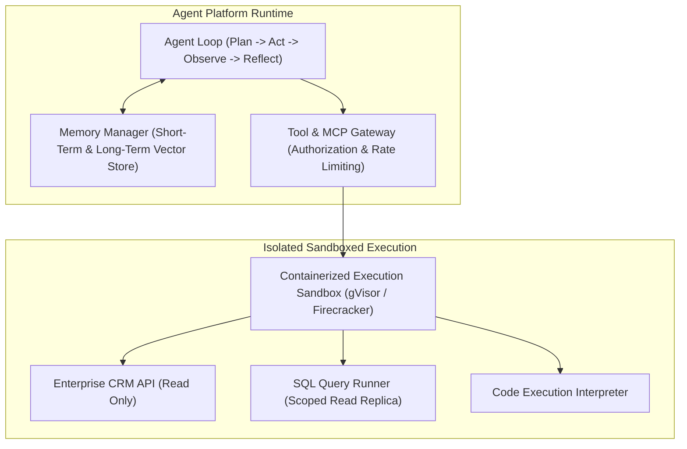

# Enterprise AI Agent Platform Architecture

## 1. Executive Summary & Capabilities

An **AI Agent Platform** provides the enterprise-grade foundation required to host, govern, and execute autonomous and semi-autonomous goal-driven agents. 

Rather than deploying agents as ad-hoc scripts with uncontrolled shell or database access, an Agent Platform enforces **strict execution sandboxing, tool authorization boundaries, stateful memory persistence, and automated kill switches**.

---

## 2. Core Agent Platform Subsystems

### 2.1 Tool Discovery & Authorization (MCP Integration)
* Standardizes tool declarations using JSON Schema and Model Context Protocol (MCP) semantics.
* Implements Attribute-Based Access Control (ABAC): an agent acting on behalf of an authenticated Tier-1 support agent cannot invoke administrative refund APIs reserved for managers.

### 2.2 Execution Sandboxing & Blast Radius Isolation
* Dynamic code generation tools (e.g., Python code interpreters for data analysis) must execute inside microVMs (AWS Firecracker) or secure container runtimes (gVisor) with zero access to the host network.

### 2.3 Circuit Breakers & Runaway Loop Prevention
* Enforces hard limits on:
  * Maximum iterations per goal (e.g., maximum 10 planning steps).
  * Maximum token budget per session (e.g., cap at 50,000 tokens).
  * Maximum execution wall-clock time (e.g., timeout after 60 seconds).
