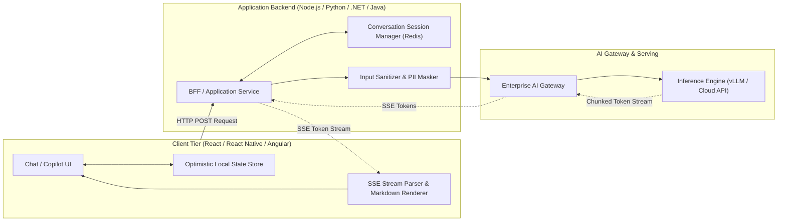

# AI Application Architecture & Frontend/Backend Topologies

## 1. Executive Summary & Architectural Challenges

Traditional web and mobile applications assume sub-500ms synchronous request-response cycles. Because foundation models generate output token-by-token over durations spanning 2 to 30 seconds, classical synchronous REST architectures produce severe user experience degradation, HTTP connection timeouts, and client abandonment.

AI Application Architecture addresses these constraints through **Server-Sent Events (SSE) token streaming, optimistic UI updates, structured state machines, and resilient asynchronous backend gateways**.

---

## 2. Key Architectural Components

### 2.1 The Streaming Pipeline (SSE vs WebSockets)
* **Server-Sent Events (SSE)** is the architectural standard for AI text generation. It operates over standard HTTP/2, traverses enterprise proxies seamlessly, and supports automatic client reconnection without the connection maintenance overhead of WebSockets.
* **WebSockets** should be reserved strictly for full-duplex multimodal applications (e.g., real-time voice-to-voice conversational AI).

### 2.2 Latency Masking & Perceived Performance
* **Time-to-First-Token (TTFT) Optimization**: The backend must start streaming tokens within 800ms of user submission.
* **Typing Cadence Smoothing**: Human reading speeds average 200–300 words per minute. Buffering token bursts into human-paced typewriter streams significantly enhances perceived system responsiveness.
