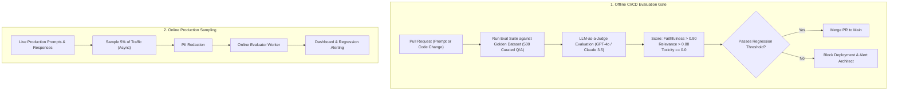

# Continuous AI Evaluation Platform Architecture

## 1. Moving Beyond "Vibe Checks"

The single largest barrier to deploying generative AI in enterprise production is the absence of rigorous, automated evaluation. Relying on ad-hoc manual inspection ("vibe checks") ensures that prompt tweaks, model upgrades, or chunking adjustments will silently degrade production output.

An **Automated AI Evaluation Platform** runs continuous offline evaluation in CI/CD pipelines and continuous online evaluation on live production traffic.

---

## 2. The Core Evaluation Triad for RAG
1. **Faithfulness**: Does the answer contain information derived *exclusively* from the retrieved context? (Measures hallucination rate).
2. **Answer Relevance**: Does the generated answer directly address the user's explicit question?
3. **Context Relevance**: Did the vector search engine retrieve concise, noise-free chunks that were actually needed to answer the question?
