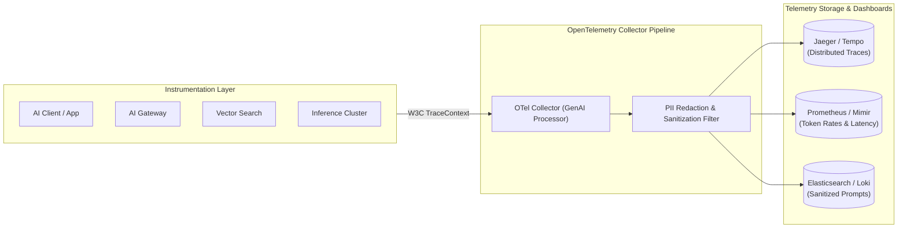

# Enterprise AI Observability & Tracing Platform

## 1. Extending OpenTelemetry to Generative AI

Traditional application performance monitoring (APM) tracks HTTP response codes, CPU utilization, and database query durations. For AI workloads, APM fails to capture the essential health indicators: **prompt tokens, completion tokens, time-to-first-token (TTFT), retrieval similarity scores, and model hallucination rates**.

An **AI Observability Platform** captures distributed traces conforming to OpenTelemetry (OTel) GenAI Semantic Conventions across gateways, retrieval engines, and inference clusters.

---

## 2. Essential SRE Metrics for GenAI

* **Time-to-First-Token (TTFT)**: Latency from HTTP submission to receipt of the very first token chunk. P99 target: $< 800\text{ms}$.
* **Time-per-Output-Token (TPOT)**: Generation speed once decoding begins. Target: $> 30\text{ tokens/sec}$ (faster than human reading speed).
* **Token Burn Rate & Cost Allocation**: Real-time expenditure rate ($/minute) aggregated by cost center and service ID.
* **Fallback Cascade Frequency**: Percentage of requests rerouted due to primary provider 429/503 errors.
