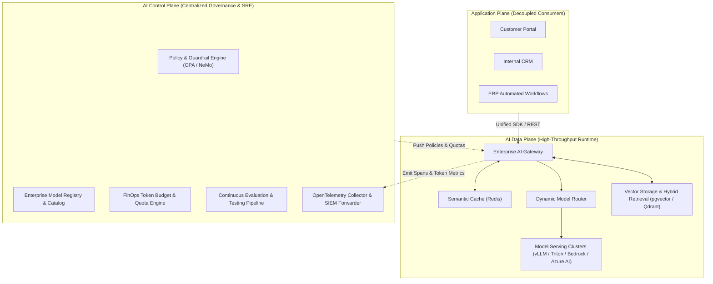

# Enterprise AI Platform Architecture

## 1. Architectural Mission & Decoupling

An Enterprise AI Platform separates the concerns of product development squads from the operational complexities of model serving, GPU infrastructure, compliance auditing, and vector retrieval.

By establishing strict architectural boundaries between the **Application Plane**, the **AI Data Plane**, and the **AI Control Plane**, the enterprise eliminates vendor lock-in and gains total governance over security, cost, and model quality.

---

## 2. Platform Invariants

1. **Vendor Independence**: Applications interface exclusively with platform abstractions (e.g., standard OpenAI-compatible API schemas); application code never imports proprietary vendor SDKs directly.
2. **Deterministic Security Perimeters**: No raw prompt reaches a model without passing through the centralized AI Gateway's input guardrails and policy enforcement engines.
3. **Zero Untracked Cost**: Every inference request must be attributed to an authenticating application ID, tenant ID, and cost center.
