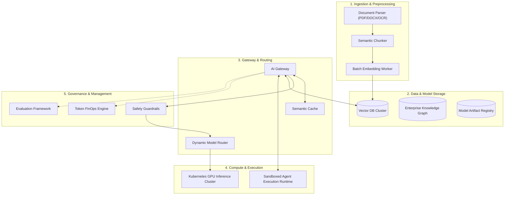

# AI Platform Functional Components Breakdown

## 1. Comprehensive Component Architecture

A production-grade Enterprise AI Platform consists of 10 modular, loosely-coupled architectural components:

---

## 2. Component Responsibility Matrix

| Component | Technology Examples | Core Responsibility |
| :--- | :--- | :--- |
| **Ingestion Engine** | Apache Tika, Unstructured.io, LangChain loaders | Extracts raw text, tables, and images from enterprise repositories (SharePoint, Confluence, S3). |
| **Semantic Chunker** | Custom recursive chunkers, Token splitters | Partitions documents into semantically coherent segments with rich metadata headers. |
| **Vector Storage** | Qdrant, Milvus, pgvector, Azure AI Search | Indexes dense embedding vectors and executes approximate nearest neighbor (HNSW) search. |
| **AI Gateway** | LiteLLM, Cloudflare AI Gateway, Kong AI Gateway | Centralized reverse proxy enforcing auth, rate limits, PII masking, and prompt caching. |
| **Model Router** | Custom Python/Go proxy, LiteLLM router | Dynamically selects model provider based on cost, latency, availability, and task type. |
| **Inference Runtime**| vLLM, NVIDIA Triton, TensorRT-LLM | High-throughput GPU execution with continuous batching and PagedAttention memory management. |
| **Agent Runtime** | Temporal, LangGraph, custom Docker sandboxes | Stateful, fault-tolerant execution of multi-step autonomous agent loops and tool invocations. |
| **Guardrails Engine**| NeMo Guardrails, Llama Guard, Azure AI Content Safety | Evaluates inbound prompts and outbound completions for injection, toxic content, and data leaks. |
| **Evaluation Engine**| Ragas, TruLens, DeepEval, custom test runners | Executes continuous automated evaluation against golden test datasets in CI/CD pipelines. |
| **FinOps Engine** | OpenCost, Prometheus, Grafana, custom BigQuery/Snowflake pipelines | Aggregates token consumption by tenant, calculates cost attribution, and enforces hard budget limits. |
