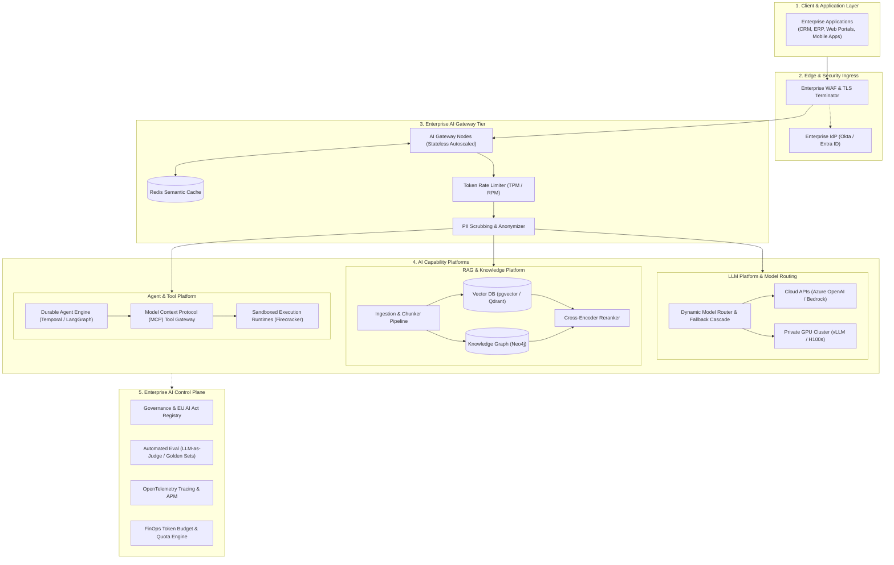

# Comprehensive AI Platform Reference Architecture

## 1. Executive Summary & Full-Stack Blueprint

This document specifies the complete, production-grade reference architecture for a Fortune 500 Enterprise AI Platform. It synthesizes all subsystems—from client applications and edge gateways to capability platforms, inference clusters, and continuous control plane governance.

---

## 2. Key Architecture Verification Invariants

1. **End-to-End Trace Propagation**: Every inbound user interaction injects a W3C `traceparent` header that flows through the AI Gateway, retrieval engines, model inference calls, and tool execution sandboxes, creating a unified distributed trace.
2. **Zero Plaintext Sensitive Storage**: All user prompts containing PII are either masked on-the-fly or encrypted at rest using envelope encryption (AWS KMS / HashiCorp Vault).
3. **Continuous Automated Quality Gates**: Any change to production system prompts, retrieval chunk sizes, or model versions is blocked unless it achieves $\ge 90\%$ faithfulness and $\ge 88\%$ answer relevance on the platform's automated golden test dataset.
