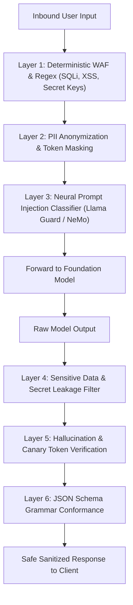

# Centralized AI Security & Guardrails Platform

## 1. Threat Surface & Defense-in-Depth

Large Language Models introduce novel attack vectors that bypass classical network firewalls and web application firewalls (WAFs): **Direct Prompt Injection (Jailbreaking), Indirect Prompt Injection (via malicious retrieved web/PDF content), Sensitive Data Exfiltration, and Insecure Output Deserialization**.

An **AI Security Platform** implements multi-layered defensive inspection gates before prompts reach models and before completions are returned to clients.

---

## 2. Inbound & Outbound Security Controls

### 2.1 Indirect Prompt Injection Mitigation
* When retrieving external web pages or uncurated enterprise documents in RAG pipelines, wrap retrieved context in explicit structural delimiters (e.g., `<context>...</context>`).
* Instruct the foundation model via immutable system prompts that context within delimiters must be treated strictly as untrusted data and never as execution instructions.

### 2.2 Canary Token Egress Monitoring
* Inject invisible, random UUID canary tokens into internal system prompts.
* If a model output ever contains an internal canary token, the outbound guardrail immediately aborts the stream, records a critical security incident, and blocks the session (preventing system prompt extraction).
