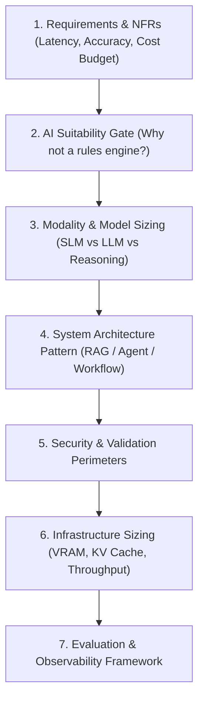

# Enterprise AI System Design Methodology

## 1. Executive Summary & Design Lifecycle

Designing an enterprise AI system requires blending classical software engineering principles with probabilistic machine learning constraints. Unlike traditional system design—where throughput, latency, and consistency are bounded by network and disk I/O—AI system design is fundamentally constrained by **GPU memory bandwidth, non-deterministic token lengths, context window limits, and stochastic outputs**.

---

## 2. Key System Design Dimensions

### 2.1 The Latency-Accuracy-Cost Triangle
In traditional systems, increasing hardware generally improves both latency and throughput. In AI systems, higher accuracy (larger parameter models or multi-step agent reasoning) **exponentially degrades latency and inflates token cost**:
* **Fast / Cheap**: 8B parameter model, single prompt completion (TTFT < 200ms, cost < $0.0002).
* **Balanced**: 70B parameter model with hybrid RAG retrieval (TTFT ~ 600ms, cost ~ $0.003).
* **Deep Reasoning / High Accuracy**: Multi-agent reflection loop with reasoning models (Latency 15s – 45s, cost > $0.05).

### 2.2 Sizing the Context Budget
Every token passed to an LLM incurs linear compute cost and quadratic attention memory overhead. Architects must budget context allocation deterministically:
$$\text{Total Context} = \text{System Prompt (10\%)} + \text{Few-Shot Examples (15\%)} + \text{Retrieved RAG Chunks (50\%)} + \text{Conversation History (15\%)} + \text{Output Headroom (10\%)}$$
