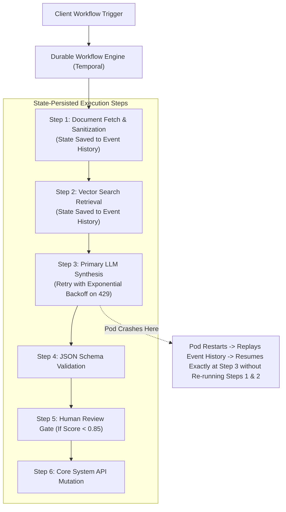

# AI Workflow Orchestration & Durable Execution

## 1. The Fragility of In-Memory AI Chains

In-memory orchestration scripts (e.g., naive Python loops, simple LangChain linear chains) are deeply fragile. When a multi-step AI workflow executes multiple LLM calls, external API queries, and document embeddings over a 60-second window, **any transient network hiccup, rate-limit error, or pod restart wipes out all in-flight state**, leaving the user with a broken operation and the business with wasted token bills.

Enterprise AI workflow orchestration mandates **Durable Execution Engines** (e.g., Temporal, AWS Step Functions, LangGraph checkpointing).

---

## 2. Orchestration Invariants

1. **Deterministic Replayability**: Workflow definitions must be deterministic. Non-deterministic operations (such as LLM generation, random UUID generation, or current time lookups) must be encapsulated within discrete durable **Activities**.
2. **Built-in Rate Limit Backoff**: When an upstream LLM API throws HTTP 429, the workflow orchestrator sleeps durably without consuming active worker memory or thread pools.
3. **Compensating Transactions**: If Step 6 fails permanently, the engine executes compensating reversal steps to preserve enterprise data consistency.
