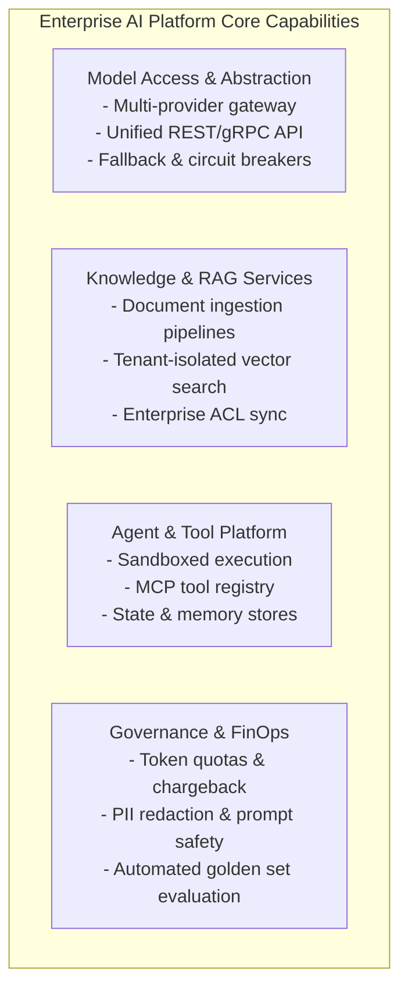

# The Enterprise AI Platform Blueprint

## 1. Executive Summary & Capabilities Matrix

The Enterprise AI Platform is a shared internal software system providing standardized, compliant, and cost-efficient AI capabilities across all business units of a Fortune 500 enterprise.

---

## 2. Core Operational Pillars

### 2.1 Centralized Model Provisioning
The platform abstracts access to:
* **Tier-1 Proprietary Cloud Models**: GPT-4o, Claude 3.5 Sonnet, Gemini 1.5 Pro (used for complex reasoning, high-stakes analysis, and code synthesis).
* **Tier-2 Fast / Cost-Optimized Models**: GPT-4o-mini, Claude 3.5 Haiku, Gemini 1.5 Flash (used for high-volume classification, summarization, and query rewriting).
* **Tier-3 Private / Open-Weights Models**: Llama-3-70B, Mistral-Large self-hosted in private VPCs for air-gapped data handling and zero-data-retention compliance.

### 2.2 Shared Knowledge Infrastructure
Instead of every squad maintaining isolated vector databases, the platform hosts a centralized, multi-tenant vector and semantic retrieval service that continuously synchronizes document permissions with enterprise Active Directory / Okta groups.
