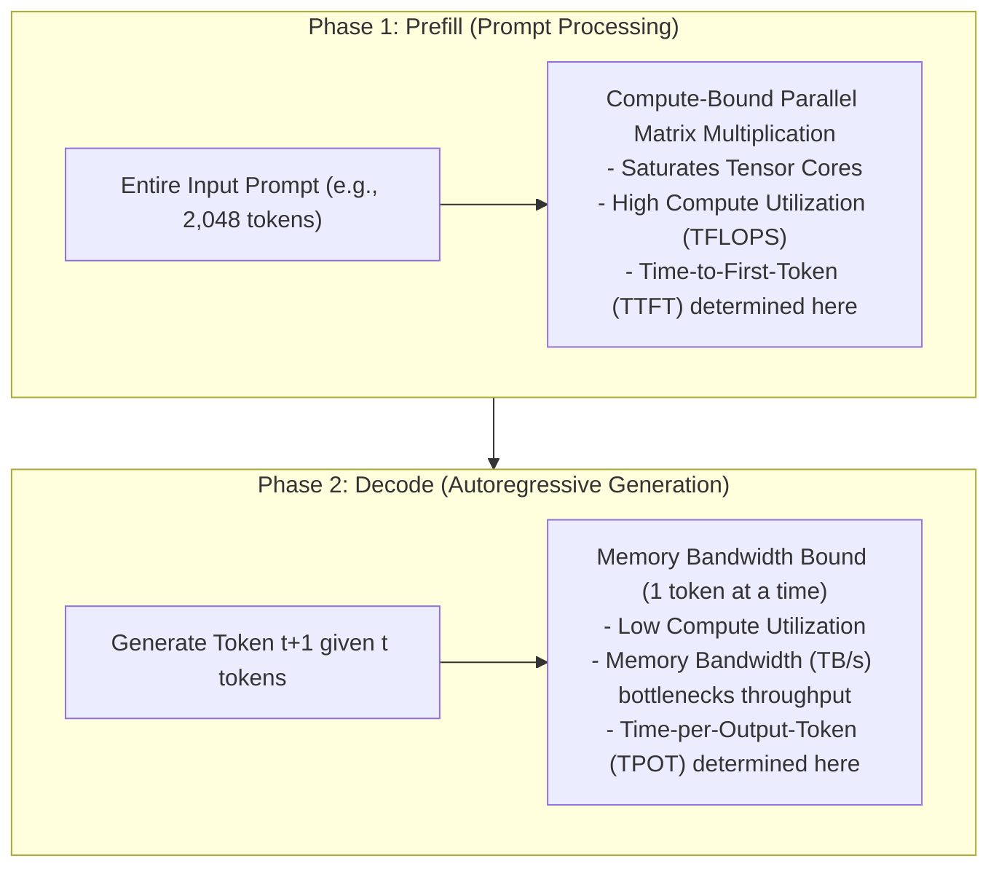

# Modern LLM Inference Architecture & Memory Dynamics

## 1. Executive Summary: The Memory-Bound Nature of LLM Inference

In traditional computing workloads, processing is compute-bound: CPU clock cycles dictate throughput. In Large Language Model inference, generation is **memory bandwidth bound**: during token generation, weights must be transferred from high-bandwidth GPU memory (HBM) to on-chip SRAM cache for every single generated token.

Understanding inference architecture requires distinguishing between two distinct computational phases: **Prefill Phase** and **Decode Phase**.

---

## 2. Breakthrough Architectural Innovations

### 2.1 PagedAttention (Virtual Memory for KV Cache)
* **Problem**: Classical serving allocated a contiguous static memory block for the maximum possible context window (e.g., 8,192 tokens) for every request, wasting up to 70% of GPU VRAM through internal fragmentation.
* **Solution**: Inspired by OS virtual memory paging, **PagedAttention** breaks the Key-Value (KV) cache into fixed-size physical memory blocks (typically 16 tokens). Memory blocks are allocated dynamically on-demand, enabling zero memory fragmentation and boosting concurrency by $3\times$ to $5\times$.

### 2.2 Continuous (Iteration-Level) Batching
* **Problem**: Traditional naive batching forced all requests in a batch to wait until the longest sequence finished generating.
* **Solution**: Continuous batching operates at the token iteration level. As soon as Request A emits `<EOS>` (end of sequence), its GPU memory is reclaimed and a new incoming Request D immediately joins the active batch on the next forward pass.
