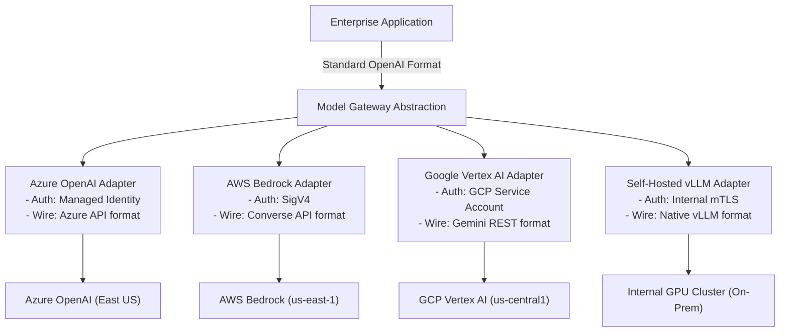

# Model Gateway & Provider Abstraction Architecture

## 1. The Multi-Provider Reality

Enterprise AI cannot rely on a single foundation model provider. Vendor outages, API price changes, rate limit throttling, and regulatory data residency requirements mandate a **multi-provider abstraction layer**.

A **Model Gateway** provides a unified API interface (standardized on the OpenAI specification), completely decoupling downstream enterprise applications from proprietary vendor wire protocols.

---

## 2. Architecture Trade-Offs

### Advantages of a Unified Model Gateway
* **Instant Vendor Swapping**: A single configuration toggle routes traffic from Provider A to Provider B with zero client code redeployment.
* **Unified Credential Storage**: Client applications do not store vendor API keys; all cloud credentials (SigV4, Azure Managed Identities) are managed securely within the gateway.
* **Consolidated Telemetry**: Generates normalized token usage metrics, latency figures, and error rates across all model providers.

### Limitations & Gotchas
* **Lowest-Common-Denominator Feature Lag**: When a provider releases cutting-edge proprietary features (e.g., custom tool-calling schemas or new multimodal audio formats), the gateway must be updated before clients can consume them.
