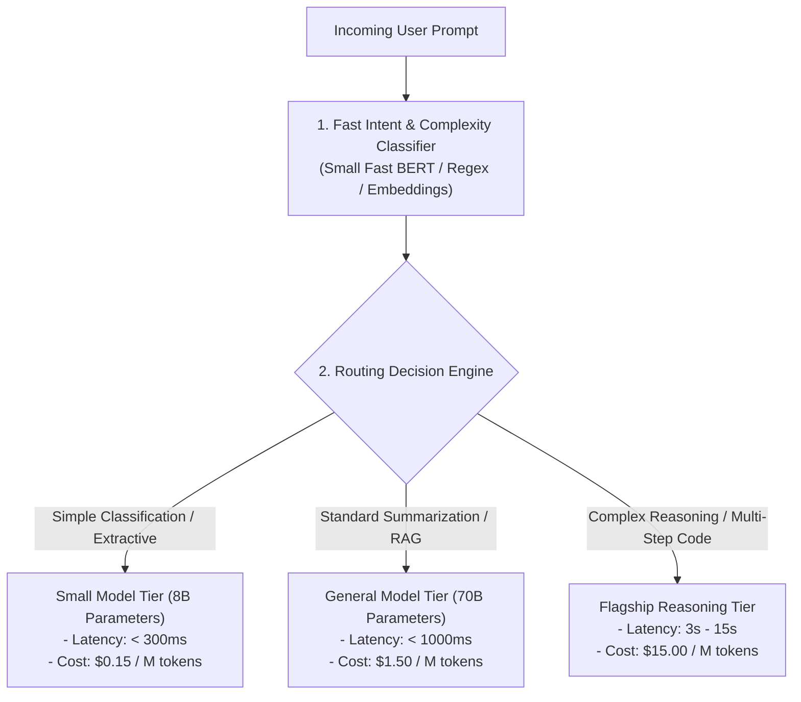

# Dynamic Model Routing Architecture

## 1. The Economic & Architectural Need for Routing

Sending every prompt to a top-tier flagship model (e.g., GPT-4o or Claude 3.5 Sonnet) is an architectural anti-pattern that wastes millions of dollars annually. Over 65% of enterprise prompts are simple extractive tasks, summarizations, or intent classifications that can be executed flawlessly by small, cost-efficient models (e.g., Llama-3-8B or GPT-4o-mini) at 5% of the cost and 20% of the latency.

**Dynamic Model Routing** inspects incoming requests and intelligently directs them to the optimal model based on task complexity, latency SLAs, cost constraints, and provider availability.

---

## 2. Routing Algorithmic Strategies

### 2.1 Complexity-Based Routing
* **Heuristic Classifier**: Analyzes prompt token length, keyword presence ("analyze", "refactor", "compare"), and required output formatting.
* **Embedding Similarity**: Measures cosine distance between incoming prompt and centroids of known complex task clusters in vector space.

### 2.2 Speculative Cascade Routing
1. Route prompt first to a low-cost, high-speed Small Language Model (SLM).
2. Execute a fast, deterministic confidence score or JSON schema validation check on the output.
3. If the SLM fails validation or expresses low confidence, transparently escalate the prompt to the flagship reasoning model.
4. **Result**: 75% of queries terminate at the low-cost tier with zero human-perceived quality degradation.
